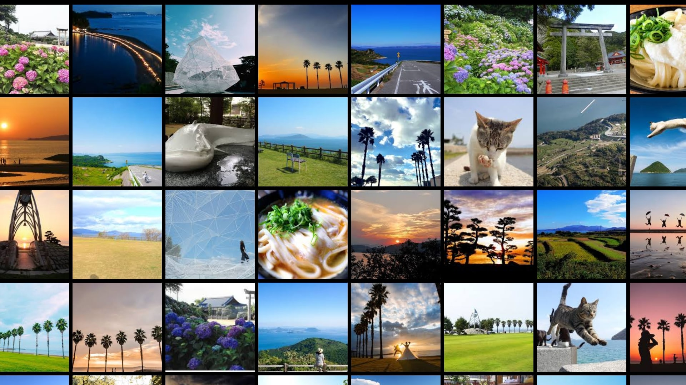
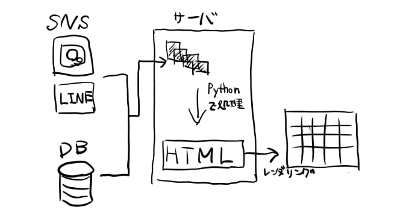

# 1. タイトル・チーム名
タイトル : インスタ映え大画面(仮)   
チーム名 : チームZhang 

# 2. 企画概要
  

「みんなでつくるフォトジェニック壁画」
インスタなどから投稿した観光地や思い出の写真が空港の壁一面の大画面に映る．
実はそれはタッチパネルになっていて，触ると写真がパラパラと動いたり，音がなったりして面白い体験ができる．
ダブルタップすると写真がめくれて，詳細な情報が知れる直感で動かせる情報媒体ともなる！

   

(現在の進捗)

# 3. 企画詳細
## Who(誰がそれを使うのか)
- 空港利用者および写真投稿者

## When(いつそれを使うのか)
- 空港営業時間内に常に稼働
  
## Where(どこでそれを使うのか)
- 大画面を壁面に設置できるスペース(メインロビーなど)

## Why(なぜそれを使うのか)
画面に興味を持った人，写真の投稿者に価値を提供することができる．  
→ どのような価値か?
- 画面に興味を持った人  
   　知らなかった場所，新しい場所の美しさを視覚に訴えかける．また，直感的に興味を持った風景や事柄に対してディレイなしで様々な情報(その風景までの経路など(by 駅すぱあと))を提供する

- 投稿した人  
    　旅の思い出，足跡を残し，次の旅行者につなげることができる．  
    また，それらに対するレスポンスを受けることができる．(実装は未定)

## What(何を作るのか)
- 機能
    - SNSのハッシュタグからフォトジェニックな画像を自動収集(ハッカソン中の実装は未定)
    - リアルタイムに更新した写真が大画面にたくさん映し出される
    - 画像に触れると動く，音が出る楽しいインタラクション
    - タッチするとそのスポットまでのルートが出る

## How(どのように作るのか)
以下のシステム構成図に従う

# 4. システム構成
 

# 5. チームメンバー紹介
【森下真伍】  
役割 : チームリーダー・バックエンド
得意な技術 : Javascript, Python, C++, PHP, SQL
開発経験 : アルバイト, 研究(コンピュータビジョン)

【松尾萌々子】  
役割 : フロントエンド  
得意な技術 : HTML, CSS, Unity  
開発経験 : アルバイト, 研究(スパースコーディング)

【松下大輝】  
役割 : 企画, プレゼン, 資料作成等  
得意な技術 : 特になし  
開発経験 : 研究(量子計算シミュレーション) 

【榊原一真】  
役割 : バックエンド  
得意な技術 : Python , 数値計算  
開発経験 : 研究(数値シミュレーション)

【森下正英】  
役割 : バックエンド  
得意な技術 : python   
開発経験 : 研究(行列計算)
